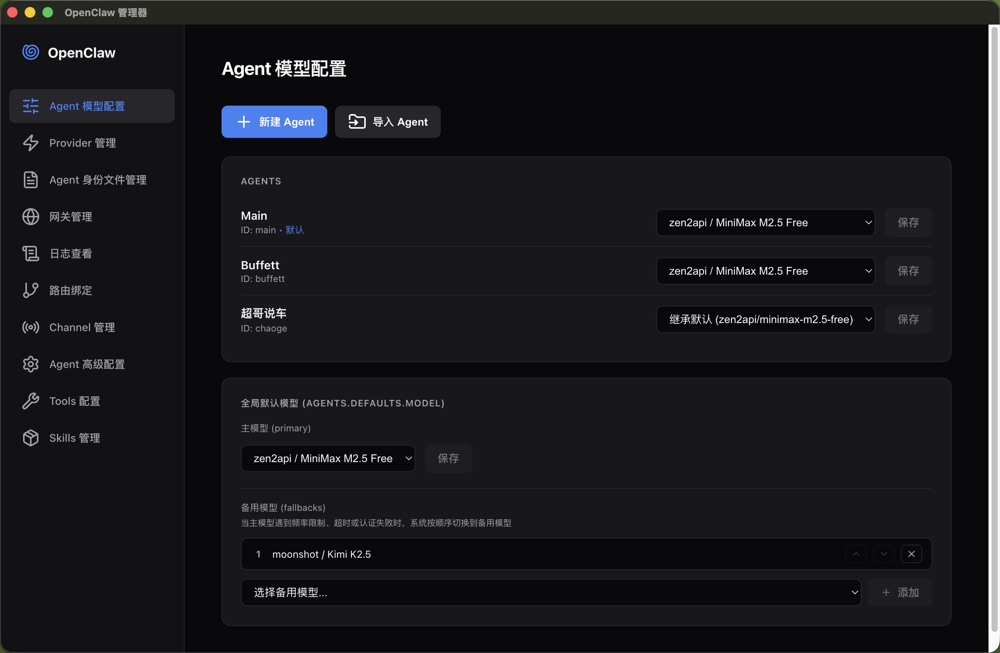
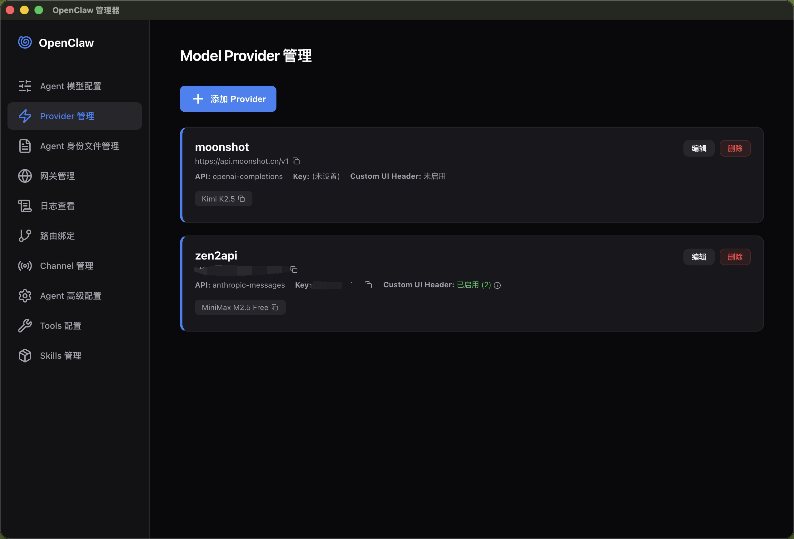
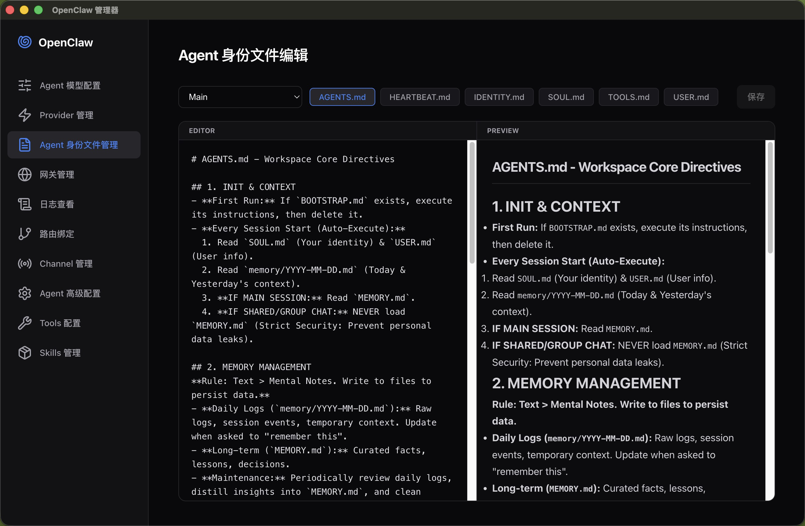
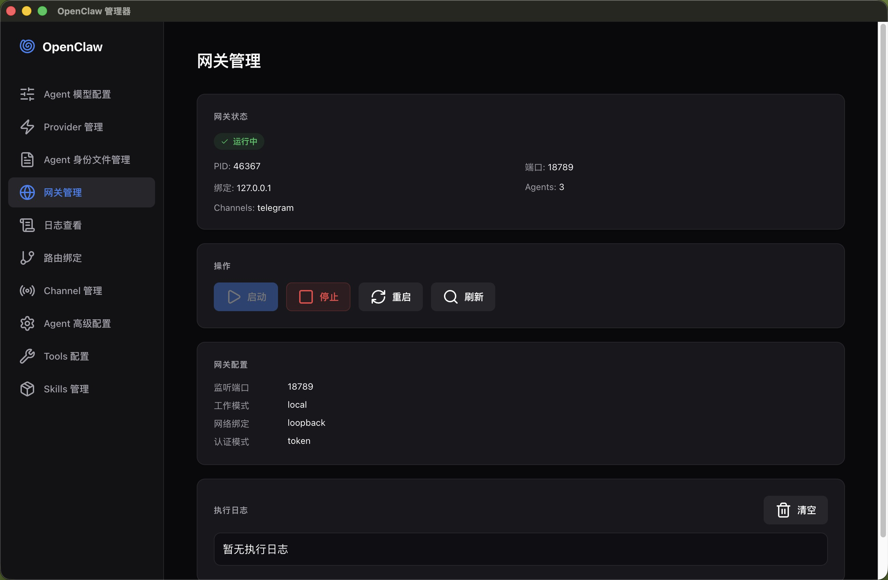
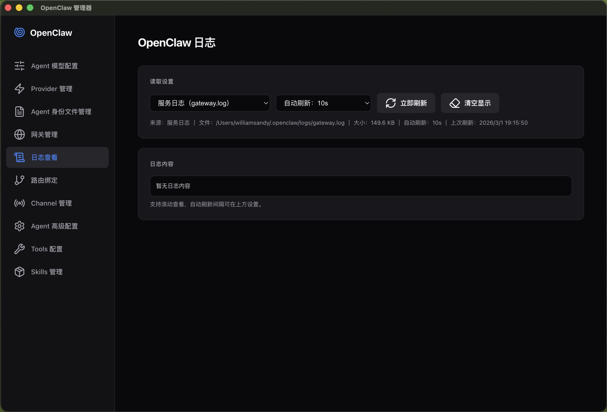
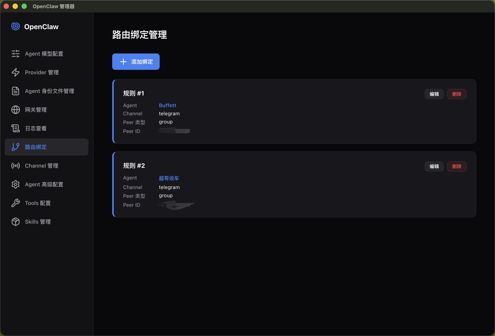
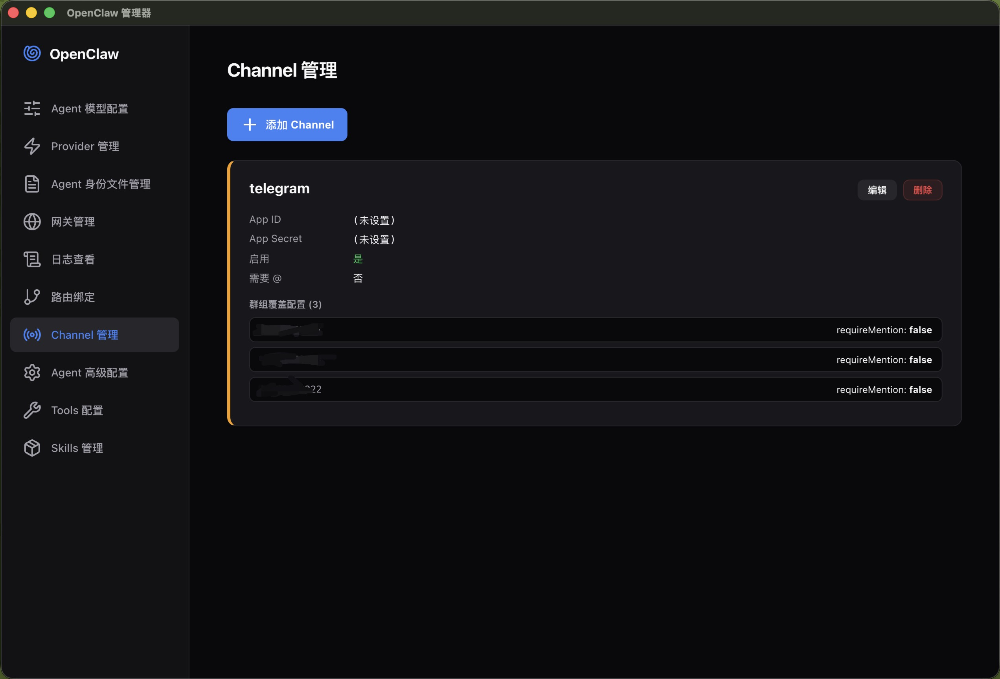
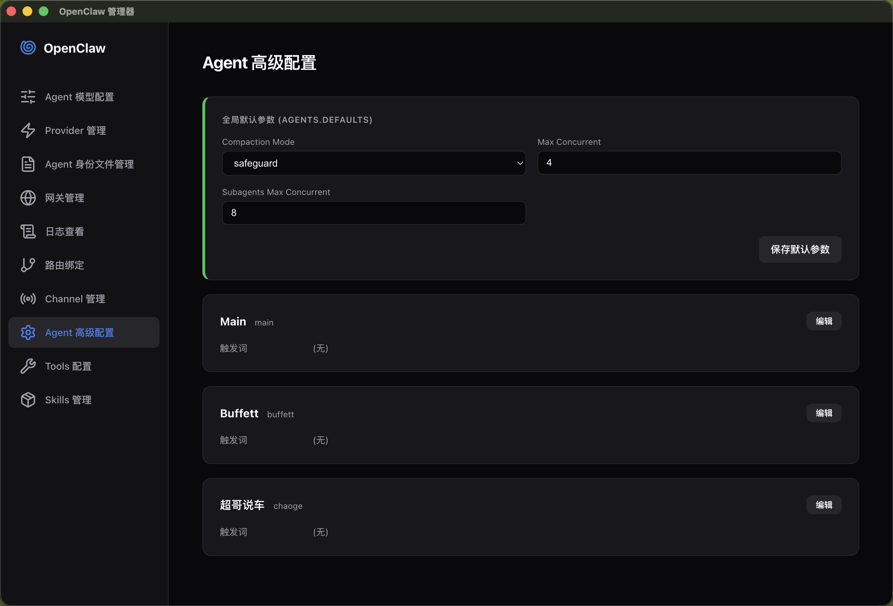
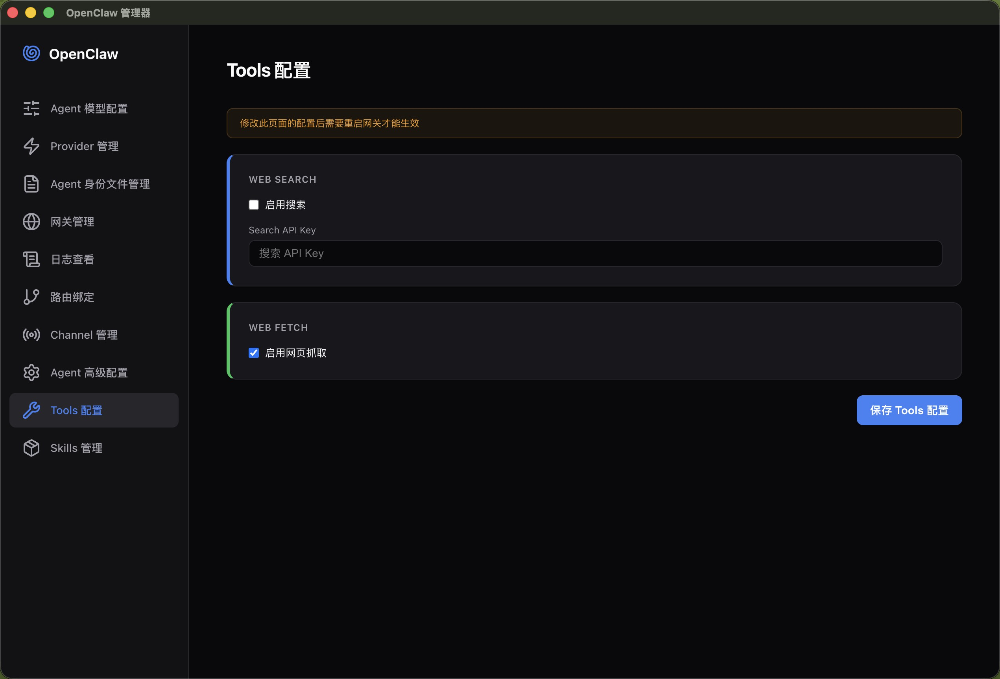
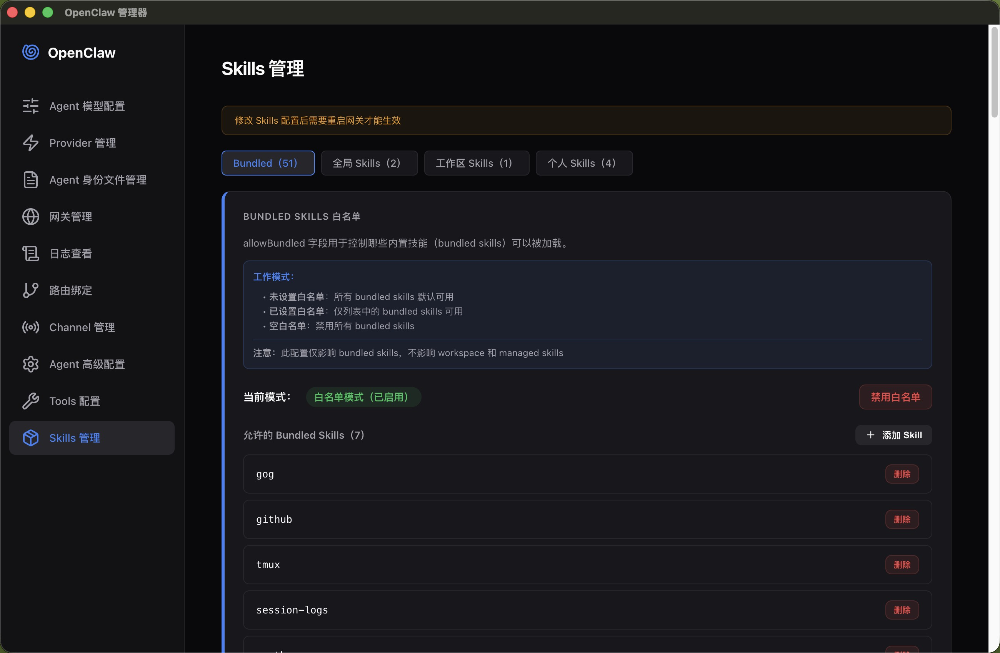

# OpenClaw 配置管理器

OpenClaw 的 Electron 桌面管理工具，提供可视化方式管理 `openclaw.json`、网关状态、日志、Skills 与常见运行参数，减少手动编辑配置文件的成本。

## 功能总览

### Agent 模型配置

按 Agent 设置主模型或继承默认模型，支持新建/导入 Agent，支持配置默认模型故障转移（`agents.defaults.model.primary` + `fallbacks`）。



### Provider 管理

新增、编辑、删除 Provider，支持远程拉取模型列表，支持自定义请求头（用于 403 兼容场景）。



### Agent 身份文件管理

浏览并编辑 Workspace 内 `.md` 文件，支持 Markdown 实时预览。



### 网关管理

查看网关状态和健康信息，执行启动、停止、重启，并记录执行日志。



### 日志查看

支持多来源日志读取、自动刷新与滚动查看。



### 路由绑定

可视化维护 `bindings`。



### Channel 管理

可视化维护 `channels`，支持分组覆盖配置。



### Agent 高级配置

维护 compaction、并发参数、group mention patterns。



### Tools 配置

维护 `tools.web.search`、`tools.web.fetch`。



### Skills 管理

查看 Bundled/全局/工作区/个人 Skills，支持 Bundled 白名单（`allowBundled`）、启用禁用、`apiKey/env` 配置。



## 使用方式

### 方法1:本地源码运行（for dev）

```bash
npm install
npm start
```

### 方法2:打包安装程序（推荐）

```bash
npm run build:win
npm run build:mac
npm run build:linux
```

打包产物位于 `dist` 目录。

## 关键行为说明

1. 配置文件路径默认是 `~/.openclaw/openclaw.json`。
2. 日志页支持三类来源：
   - Gateway 文件日志（优先读取 `logging.file`，否则回退到 `/tmp/openclaw/openclaw-YYYY-MM-DD.log`）。
   - 服务标准输出日志（`$OPENCLAW_STATE_DIR/logs/gateway.log`，未设置时回退 `~/.openclaw/logs/gateway.log`）。
   - 服务错误日志（`$OPENCLAW_STATE_DIR/logs/gateway.err.log`，未设置时回退 `~/.openclaw/logs/gateway.err.log`）。
3. Skills 页面遵循官方语义：
   - `allowBundled` 仅影响 Bundled Skills。
   - `skills.entries.<skill>.enabled/apiKey/env` 用于单 Skill 开关与环境配置。
4. Tools 与 Skills 配置修改后，通常需要重启网关生效（界面会提示）。
5. 关闭窗口时可选择“最小化到托盘”或“直接退出”，并记住偏好。

## 已知限制

1. 当前配置读取使用严格 JSON 解析；如果 `openclaw.json` 包含 JSON5 注释或尾逗号，界面会加载失败。
2. Workspace 编辑器当前仅展示和编辑 `.md` 文件。
3. 某些 Channel 配置是否可热生效取决于 OpenClaw 运行时能力；界面会给出“需重启网关”的提示。
